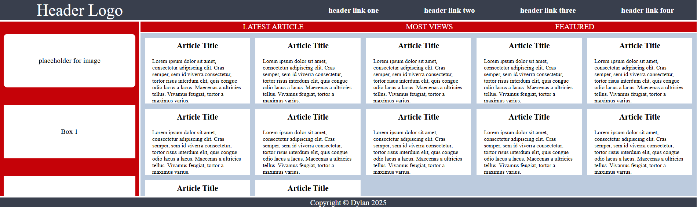

# Holy Grail Mockup with Grid

Now that you've made your Holy Grail layout responsive, we are going to have some fun making it a bit more complicated and adding some features. You might find this to be a bit more challenging than you expected. You might even be tempted to use Flexbox. But for the sake of this practice assignment, try and see if you can figure out how to recreate this entire mockup using only Grid. Feel free to add in your own dummy content or styling too!

## Desired Outcome

If you use the tools in the Advanced Grid Properties lesson you should be able to get your article cards to automatically fit as the browser window is adjusted:

## My Outcome

### Hints
- For this exercise you will need to add some CSS declaration blocks to the style.css file. Look through the HTML to see what selectors and combinators you can use.
- Take the layout one section at a time
- You don't need to add or change anything to the HTML, but it will be helpful to look through the parent and child relationships between elements
- Just like with Flexbox, you can easily center an item by making it into a grid
- Don't worry about the placeholder image element stretching when resizing the browser window. This will be covered in the Responsive lessons

### Self Check
- The container element has two columns
- The container's second column is 4 times larger than the first column
- The container element has a gap of 4px
- The header element has two columns
- The `ul` inside the menu element contains another grid
- The `ul` inside the nav element contains another grid
- The sidebar element has a gap of 50px
- The text elements in the sidebar are centered with grid
- The article element should set grid columns using `repeat` along with the `auto-fit` and `minmax` properties
- The article columns should have a minimum value of 250px and a maximum of 1fr unit
- The article element has a gap of 15px
- The card elements inside the article container have a height of 200px
- The header and footer span across both columns
- The sidebar only spans across the first column
- The nav and article elements only span across the second column
